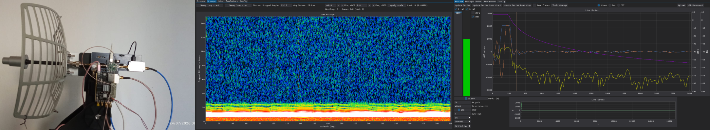

# Experimental Radar System

<<<<<<< HEAD
A Zynq-based experimental radar platform combining RF hardware, FPGA data acquisition, embedded firmware, high-speed data streaming, host-side processing, visualization, and field testing. Short demonstration videos are available on LinkedIn:
1. [Radar demonstration — Video 1](https://www.linkedin.com/posts/inhardwetrust_embeddedsystems-radar-dataacquisition-ugcPost-7486320140091953152-lGaw/?utm_source=share&utm_medium=member_desktop&rcm=ACoAADvFVyABfNqGFh66NaA-U5veZQf_8hqvCkg)
2. [Radar demonstration — Video 2](https://www.linkedin.com/posts/inhardwetrust_embeddedsystems-radar-dataacquisition-ugcPost-7486319785337716736-4Fbc/?utm_source=share&utm_medium=member_desktop&rcm=ACoAADvFVyABfNqGFh66NaA-U5veZQf_8hqvCkg).


A Zynq-based experimental radar platform combining RF hardware, FPGA data acquisition, embedded firmware, high-speed data streaming, host-side processing, visualization, and field testing.


## 1. System Intro

This project is a **monostatic pulsed radar demonstrator** built around a Xilinx Zynq device and a low-cost OpenSDR board based on the AD9363 RF transceiver. The same antenna is used for transmission and reception through a circulator, while the Zynq combines deterministic FPGA-side timing and acquisition with software-controlled configuration, transport, and system management.

At the PL level, the acquisition controller contains two synchronized pipelines: **TX** and **RX**. The Zynq Processing System configures the controller and issues a `START` command. Both pipelines are activated at the same time:

- the RX path captures complex I/Q samples arriving from the AD9363 over its high-speed DDR digital interface;
- the TX player streams a waveform that was preloaded into memory to the AD9363 transmit channel.

After the digital group delay of the TX and RX FIR filters, a strong copy of the transmitted waveform appears in the received data. It is produced by direct TX-to-RX leakage and by the finite isolation of the circulator. This signal provides a deterministic timing reference for the frame. It is followed by strong near-field reflections and local clutter, which currently create a blind region of roughly 40 m, and then by echoes from more distant objects.

The current test waveform is a simple unmodulated **CW burst** containing approximately four million samples at a sampling rate of **61.44 MS/s**. The architecture itself is waveform-independent: the TX payload may contain an arbitrary pulse, coded sequence, modulation pattern, or other digitally generated waveform. More advanced waveforms and pulse-compression techniques are planned for longer-range detection. Current short-range experiments use an RF bandwidth of **20 MHz**. This relatively wide bandwidth supports short pulses and improved range resolution, although it also increases the integrated receiver noise. At short range, this trade-off is acceptable because the reflected signals are comparatively strong.

### In-band frame metadata

A small leading part of every acquired frame, corresponding approximately to the first 10 m of range, is reserved for service information. The PL controller overwrites the received samples in this region and injects metadata directly into the data stream, including:

- hardware frame ID;
- antenna azimuth angle;
- acquisition and synchronization information;
- additional status fields used for transport validation.

As a result, every frame is permanently associated with the antenna angle at which it was captured. The frame ID also allows the host software to identify dropped, duplicated, or out-of-order frames without relying on a separate metadata channel.

### Data transport

After capture, the sample stream passes through a PL-side FIFO and is transferred over AXI Stream to system memory by the DMA controller. Before acquisition starts, the PS firmware configures the DMA buffers and prepares the transport path.

The PS continuously receives completed DMA buffers and forwards them to the host through a USB bulk endpoint. If the USB path cannot transmit a frame before the next buffer must be processed, the following frame is discarded rather than blocking the real-time acquisition chain. The host detects such events from discontinuities in the hardware frame ID. A separate PL-side backpressure detector provides additional hardware-level monitoring of the acquisition path.

In the current implementation, the USB transport sustains approximately **150 Mbit/s** without observed frame loss during normal operation.

### Single capture and continuous streaming

The sequence above describes a single acquisition frame. In normal operation, however, the PL controller runs in continuous streaming mode. It autonomously starts new captures at a programmable interval and produces a continuous stream of angle-tagged I/Q frames.

This architecture supports both real-time visualization and processing with accumulation across multiple frames. Non-coherent accumulation can already be implemented on the host. Coherent accumulation has not yet been validated; before enabling it, the long-term phase stability of the complete I/Q signal path must be measured and characterized.

### Signal path

```text
Antenna
   ↓
Circulator / RF front end
   ↓
Receiver and ADC
   ↓
FPGA / Zynq PL
   ↓
DMA
   ↓
Zynq PS
   ↓
USB bulk streaming
   ↓
Python host software
   ↓
Capture / Storage / A-scope / B-scope / Processing
```

### Control path

```text
Python host software
   ↓
USB command interface
   ↓
Zynq PS firmware
   ↓
FPGA control / UART
   ↓
Motor drive / antenna angle / TX amplifier gating
```

---

## 5. Key Technical Characteristics

Lorem ipsum dolor sit amet, consectetur adipiscing elit. This section should summarize the most important measurable properties of the system.

| Parameter | Current value |
|---|---:|
| Processing platform | Xilinx Zynq |
| Acquisition architecture | FPGA / PL → DMA → PS |
| Host interface | USB bulk |
| Host software | Python |
| Visualization | A-scope, B-scope |
| Antenna operation | Motorized rotation |
| Angle synchronization | Integrated with acquisition pipeline |
| Data mode | Continuous streaming and single capture |
| Signal processing | Range-profile processing and visualization |
| Development status | Working experimental prototype |

---

## Project Media

Additional screenshots, hardware photographs, field-test images, and demonstration videos will be added as the project documentation is expanded.
